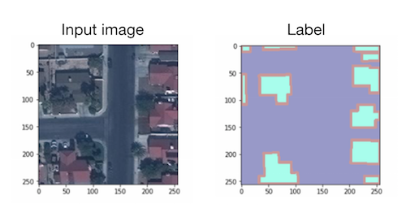
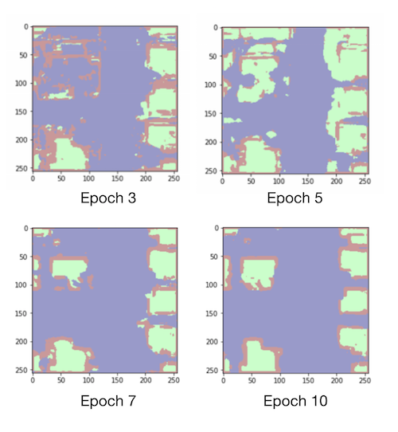

*This repository was originally at https://github.com/aiforearth/SpaceNetExploration*. For other Microsoft AI for Earth repositories, search for the topic `#aiforearth` on GitHub or visit them [here](https://github.com/search?l=&q=user%3Amicrosoft+topic%3Aaiforearth&type=Repositories).

# Building Footprint Extraction

## Overview
This repository contains a walkthrough demonstrating how to perform semantic segmentation using convolutional neural networks (CNNs) on satellite images to extract the footprints of buildings. We show how to carry out the procedure on an Azure Deep Learning Virtual Machine (DLVM), which are GPU-enabled and have all major frameworks pre-installed so you can start model training straight-away. We use a subset of the data and labels from the [SpaceNet Challenge](http://explore.digitalglobe.com/spacenet), an online repository of freely available satellite imagery released to encourage the application of machine learning to geospatial data.

The blog post that first announced this sample project is [here](https://azure.microsoft.com/en-us/blog/how-to-extract-building-footprints-from-satellite-images-using-deep-learning/) on the Azure Blog.


## Data

### SpaceNet Building Footprint Extraction Dataset
The code in this repository was developed for training a semantic segmentation model (currently two variants of the U-Net are implemented) on the Vegas set of the SpaceNet building footprint extraction [data](https://spacenetchallenge.github.io/). This makes the sample code clearer, but it can be easily extended to take in training data from the four other locations.

The organizers release a portion of this data as training data and the rest are held out for the purpose of the competitions they hold. For the experiments discussed here, we split the official training set 70:15:15 into our own training, validation and test sets. These are 39 GB in size as raw images in TIFF format with labels.


### Generate Input from Raw Data
Instruction for downloading the SpaceNet data can be found on their [website](https://spacenetchallenge.github.io/). The authors provide a set of utilities to convert the raw images to a format that semantic segmentation models can take as input. The utilities are in this [repo](https://github.com/SpaceNetChallenge/utilities). Most of the functionalities you will need are in the `python` folder. Please read their instructions on the repo's [README](https://github.com/SpaceNetChallenge/utilities) to understand all the tools and parameters available. After using `python/createDataSpaceNet.py` from the utilities repo to process the raw data, the input image and its label look like the following:




## Environment Setup
### Provision an Azure Deep Learning Virtual Machine
You could train your models on a Deep Learning Virtual Machine ([DLVM](https://azuremarketplace.microsoft.com/en-ca/marketplace/apps/microsoft-ads.dsvm-deep-learning)) on Azure to get started quickly, where all the major deep learning frameworks, including PyTorch used in this repo, are installed and ready to use. These VMs are configured specifically for use with GPUs. Instructions for provisioning can be found [here](https://docs.microsoft.com/en-us/azure/machine-learning/data-science-virtual-machine/provision-deep-learning-dsvm). The code here has been used on a Ubuntu Linux DLVM, but you should be able to use it on a Windows DLVM with minor modifications to the commands such as those setting environment variable values. The commands on this page are for running in a Linux shell.


### Additional Packages to Install
There are two additional packages for the polygonization of the result of the CNN model so that our results can be compared to the original labels, which are expressed in a polygon data type. You can install these using `pip`:

```
pip install rasterio
pip install shapely
```


### Data Storage Options
For quick experimentations you could download your data to the OS disk, but this makes data transfer and sharing costly when you scale out.

There are several options for storing the data while you perform computation on them in Azure. Here's a piece of [documentation](https://docs.microsoft.com/en-us/azure/storage/common/storage-decide-blobs-files-disks) to guide you through choosing among these, and here are the [pricing](https://azure.microsoft.com/en-us/pricing/details/storage/) information.

If you are not planning on training models distributedly across several machines, you could attach a data disk to your VM. See [instructions](https://docs.microsoft.com/en-us/azure/virtual-machines/linux/attach-disk-portal) on attaching a data disk to a Linux VM. You can later re-attach this data disk to a more powerful VM, but it can only be attached to one machine at a time.

For both Azure [Blob Storage](https://azure.microsoft.com/en-us/services/storage/blobs/) and [File Share](https://azure.microsoft.com/en-us/services/storage/files/), you can browse the files stored from any computer using the [Storage Explorer](https://azure.microsoft.com/en-us/features/storage-explorer/) desktop app. Both blob storage containers and file shares can be mounted on your VM so you can use them as if they were local disks. See instructions for mounting [blob storage](https://docs.microsoft.com/en-us/azure/storage/blobs/storage-how-to-mount-container-linux) and [file shares](https://docs.microsoft.com/en-us/azure/storage/files/storage-how-to-use-files-linux). Note however that such file systems have different performance for writing and deleting files than local file systems. Please refer to Azure Storage [performance targets](https://docs.microsoft.com/en-us/azure/storage/common/storage-scalability-targets?toc=%2fazure%2fstorage%2fqueues%2ftoc.json) for more information.


## Model Training
We tackle the problem of outlining building footprints in satellite images by applying a semantic segmentation model to first classify each pixel as background, building, or boundary of buildings. The [U-Net](https://lmb.informatik.uni-freiburg.de/people/ronneber/u-net/) is used for this task. There are two variants of the U-Net implemented in the [models](./models) directory, differing by the sizes of filters used. The baseline U-Net is a similar version as used by the winner of the SpaceNet Building Footprint competition [XD\_XD](https://github.com/SpaceNetChallenge/BuildingDetectors_Round2/tree/master/1-XD_XD). We referenced several open source implementations, noted in the relevant files.

Code for training the model is in the [pipeline](./pipeline) directory. The training script is `train.py` and all the paths to input/output, parameters and other arguments are specified in `train_config.py`, which you can modify and experiment with. The default configuration has `total_epochs` set to 15 to run training for 15 epochs, which takes about an hour in total on a VM with a P100 GPU (SKU NC6s_v2 on Azure). For the sample image above, the result of the segmentation model is as follows at epoch 3, 5, 7 and 10:




## Generate Polygons of the Building Footprints
Standard graphics techniques are used to convert contiguous blobs of building pixels identified by the segmentation model, using libraries [Rasterio](https://github.com/mapbox/rasterio) and [Shapely](https://github.com/Toblerity/Shapely). The script `pipeline/polygonize.py` performs this procedure, and you can change various parameters in `polygonize_config.py` in the same directory. The most important parameter influencing the performance of the model is `min_polygon_area`, which is the area in squared pixels below which blobs of building pixels are discarded, reducing the noise in our results. Increasing this threshold decreases the number of false positive footprint proposals.


## Evaluation

The evaluation metric used by the SpaceNet Challenge is the F1 score, where a footprint proposal is counted as a true positive if its intersection over union ([IoU](https://www.pyimagesearch.com/2016/11/07/intersection-over-union-iou-for-object-detection/)) with the ground truth polygon is above 0.5.

You can of course employ your own metric to suit your application, but if you would like to use the SpaceNet utilities to compute the F1 score based on polygons of building footprints, you need to first combine the annotations for each image in geojson format into a csv with `python/createCSVFromGEOJSON.py` from the utilities [repo](https://github.com/SpaceNetChallenge/utilities). In the root directory of `utilities`, run

```
python python/createCSVFromGEOJSON.py -imgDir /tutorial_data/val/RGB-PanSharpen -geoDir /tutorial_data/val/geojson/buildings -o ground_truth.csv --CreateProposalFile
```


Then you can use `python/evaluateScene.py` to compute the F1 score, giving the ground truth csv produced from the last command and the csv output `proposals.csv` produced by `pipeline/polygonize.py` in this repo:

```
python python/evaluateScene.py ground_truth.csv proposal.csv
```


## Related Materials

Bing team's [announcement](https://blogs.bing.com/maps/2018-06/microsoft-releases-125-million-building-footprints-in-the-us-as-open-data) that they released a large quantity of building footprints in the US in support of the Open Street Map community, and [article](https://github.com/Microsoft/USBuildingFootprints) briefly describing their method of extracting them.

Very helpful [blog post](http://jeffwen.com/2018/02/23/road_extraction) and [code](https://github.com/jeffwen/road_building_extraction) on road extraction from satellite images by Jeff Wen on a different dataset. We also took inspiration in structuring the training pipeline from this repo.

SpaceNet [road extraction](https://spacenetchallenge.github.io/Competitions/Competition3.html) challenge.

[Tutorial](https://github.com/Azure/pixel_level_land_classification) on pixel-level land cover classification using semantic segmentation in CNTK on Azure.


